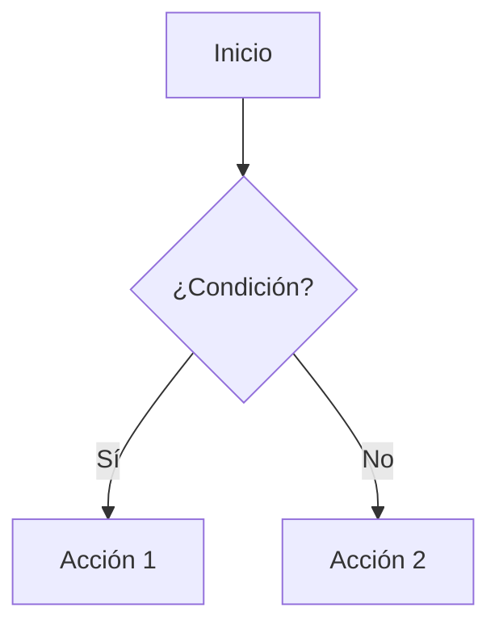

# Ejemplos de aplicación: Reglas para Markdown

## Índice

- [Resumen](#resumen)
- [Ejemplo simple](#ejemplo-simple)
- [Ejemplo intermedio](#ejemplo-intermedio)
- [Ejemplo avanzado](#ejemplo-avanzado)
- [Anti-patrones frecuentes](#anti-patrones-frecuentes)
- [Checklist de revisión](#checklist-de-revisión)
- [Glosario](#glosario)
- [Referencias](#referencias)

## Resumen

Buenas prácticas para documentación en Markdown, desde la estructura básica hasta la integración de diagramas y enlaces avanzados.

## Ejemplo simple

Documento con encabezados y tabla:

```markdown
# Visión general

| Componente | Descripción |
|------------|-------------|
| API        | Expone endpoints REST |
| Frontend   | Interfaz de usuario  |
```

## Ejemplo intermedio

Incluye índice, enlaces internos y advertencias:

```markdown
# Visión general

## Índice
- [API](#api)
- [Frontend](#frontend)

> ⚠️ **Advertencia:** No modifiques este archivo sin revisión de equipo.
```

## Ejemplo avanzado

Uso de diagramas Mermaid y glosario:



## Anti-patrones frecuentes

- Encabezados desordenados o sin jerarquía.
- Tablas o listas mal formateadas.
- No usar índices ni enlaces internos.

## Checklist de revisión

- [ ] ¿El documento tiene estructura lógica y encabezados claros?
- [ ] ¿Incluye índice y enlaces internos?
- [ ] ¿Se usan tablas, listas y diagramas cuando corresponde?
- [ ] ¿Se siguen las reglas de markdownlint?

## Glosario

- **Mermaid:** Lenguaje para crear diagramas editables en Markdown.
- **Advertencia (admonition):** Bloque destacado para alertas o notas importantes.

## Referencias

- [Guía de estilo Markdown (GitHub)](https://guides.github.com/features/mastering-markdown/)
- [Mermaid Live Editor](https://mermaid.live/)
